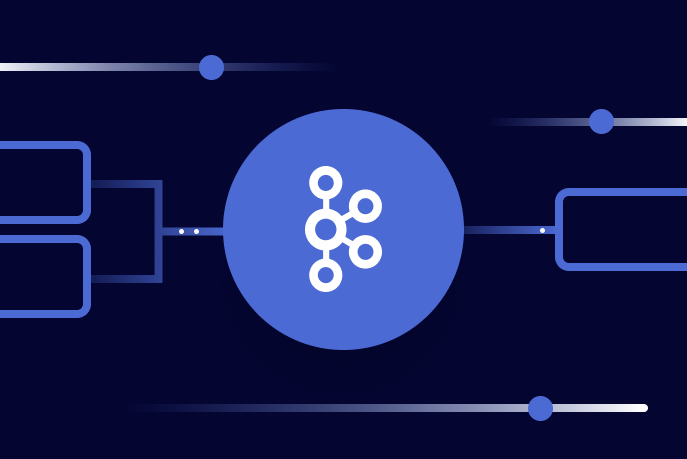

# SIGNAL: What matters in distributed systems

**March 2026 | Issue #1**

*Akka launches Agentic AI platform built on MCP — the same week Perplexity's CTO publicly dumps the protocol.*

**Welcome to SIGNAL.** This is a monthly briefing for CTOs, VP Engineering, and Chief Architects running distributed systems at scale. We don't aggregate news. We aggregate lessons.

Every month: one architecture debate with real trade-offs, one production war story with solutions, and three critical signals with business context. No hype cycles. No vendor pitches. Just what you need to know to make better infrastructure decisions.

**This month:** Akka launches an Agentic AI platform built entirely on MCP — the same week Perplexity's CTO publicly dumps the protocol. The MCP backlash intensifies as the dev world argues whether it's enterprise governance or unnecessary overhead.

---

## Today

• **[Akka launches Agentic AI](https://akka.io/blog/announcing-akkas-agentic-ai-release)** on MCP — the same week Perplexity's CTO dumps the protocol  
• **[KIP-1150](https://cwiki.apache.org/confluence/display/KAFKA/KIP-1150%3A+Diskless+Topics)** makes diskless Kafka official — two paths to S3-backed streaming converge  
• **[Kafka 4.2](https://kafka.apache.org/downloads#4.2.0)** graduates Share Groups — scale consumers by workload, not partition count  
• **[Scala 3.8](https://www.scala-lang.org/news/3.8/)** locks in JDK 17, 3.9 LTS approaches with the same floor  
• **[Mill 1.0](https://github.com/com-lihaoyi/mill/releases/tag/1.0.0)** ships — 3-6x faster builds than sbt

---

## The Architecture Debate: MCP Protocol — Enterprise Governance or Overhead?

**[Akka launches Agentic AI](https://akka.io/blog/announcing-akkas-agentic-ai-release)** in March 2026. Lightbend, now rebranded as Akka, shipped four new components: Orchestration for multi-agent workflows, Agents with MCP tool support, Memory as durable sharded state, and Streaming for real-time AI processing. All included in existing licenses. The positioning is direct — they're going after LangChain and LlamaIndex with enterprise SLAs.

**The same week, Perplexity's CTO dumps MCP.** Denis Yarats announced at Ask 2026 they're replacing MCP with direct APIs and CLIs. The criticism is operational, not theoretical: MCP tool definitions consume context window (10-50x more tokens than CLI equivalents), auth is clunky, and the protocol adds abstraction over APIs that already exist.

**The divide nobody is talking about:** MCP runs in two modes. Stdio (local) keeps the server on your machine. Remote HTTP puts it on a centralized server. The backlash conflates both. Centralized MCP gives teams one place to manage auth, track tools, and keep prompts consistent. CLIs run as you — your credentials, your permissions, no audit trail. For one developer on their laptop, fine. For 50 engineers touching production, terrifying.

**Scalac angle:** The framing is wrong. It's not "MCP or CLI" — it's governance versus speed. Internal tooling with fixed integrations and solo developers? CLIs are faster and cheaper. Multi-tenant enterprise environments needing centralized auth, observability, and audit trails? MCP earns its overhead. Smart teams use CLIs where the model already understands the tool, MCP where they need unified governance. The protocol got overhyped early, but its real story was always enterprise adoption.

🔗 [Akka Agentic AI Announcement](https://akka.io/blog/announcing-akkas-agentic-ai-release) · [Perplexity MCP Discussion](https://news.ycombinator.com/item?id=43345612)

---

## Notes from the Trenches: Kafka 4.2 — Diskless Topics and Share Groups

*Hero image from Confluent blog — Apache Kafka 4.2.0 release*

**Apache Kafka approves [KIP-1150](https://cwiki.apache.org/confluence/display/KAFKA/KIP-1150%3A+Diskless+Topics).** The community voted yes on March 2nd, making diskless topics officially part of the roadmap. Brokers serve partitions directly from object storage using a leaderless architecture.

The catch: production readiness is 2027 at earliest. KIP-1164 (Batch Coordinator) and sub-proposals still need implementation.

**Confluent acquired WarpStream in January.** The proprietary fork already delivers 80% cost reductions for log analytics. Robinhood runs 10+ TB/day through it. Latency remains 100-500ms — fine for logs, unacceptable for sub-50ms p99 transactions.

**The migration decision:** KIP-1150 offers gradual, topic-by-topic migration. WarpStream requires ripping out brokers entirely. Greenfield teams choose between vendor lock-in today (WarpStream works now) versus migration complexity tomorrow (KIP-1150 is 2027).

**Scalac angle:** Existing Kafka estates should wait for KIP-1150. Running both systems defeats the purpose. Greenfield without latency constraints? WarpStream carries less risk than betting on 2027 timelines. The decision is organizational tolerance for vendor lock-in versus timeline uncertainty — not which technology is "better."

**The partition-to-consumer binding has been Kafka's fundamental scaling constraint since 2011.**

With 4.2.0, [KIP-932](https://cwiki.apache.org/confluence/display/KAFKA/KIP-932%3A+Queues+for+Kafka) graduates to production-ready, introducing Share Groups that decouple parallelism from partition count.

**The Problem:** A topic with 12 partitions maxed out at 12 concurrent consumers. Need more throughput? You re-partition — a destructive operation requiring downtime and backfill.

**The Solution:** Share Groups use cooperative consumption with individual acknowledgment tracking. Multiple consumers can now process records from the same partition concurrently, with the broker managing delivery counts and lock timeouts. KIP-1222 adds lease extension for long-running tasks — send a RENEW acknowledgment to prevent reassignment during processing.

**Migration Reality:** Share Groups require new consumer clients (4.2+) and explicit opt-in. Existing consumer groups work unchanged. The critical change is operational: you can now scale consumers based on CPU/memory constraints rather than partition geometry.

**Scalac angle:** Test Share Groups on your heaviest read workloads — the ones where you've been forced to over-partition to achieve parallelism. Use `share.acquire.mode=record_limit` for strict memory limits. Don't migrate everything. Use Share Groups for the 20% of topics that need elastic scaling, keep traditional groups for the 80% where partition affinity matters.

---

## Signal Over Noise: Three Critical Changes This Month

### 1. Scala 3.8 requires JDK 17, and 3.9 LTS locks it in

**Released February 24, 2026.** The `betterFors` feature stabilised with subtle semantic changes — for-comprehensions over Maps now return `Map` instead of `List` in certain cases.

The 3.3 LTS line continues supporting JDK 8 until Q2 2027, but all new development requires JDK 17 minimum. For library authors: cross-compile to 3.3 LTS if you need JDK 8 compatibility; otherwise target 3.8+ with JDK 21 LTS for optimal performance.

### 2. Mill 1.0 ships as viable sbt alternative

**Released March 2026.** The Scala build tool promises 3-6x faster builds than sbt through aggressive caching and parallelization. Native launchers reduce startup to ~100ms. Full Scala Native support and Kotlin interoperability make it a genuine alternative for teams struggling with sbt complexity.

### 3. Microsoft's C/C++ elimination goal is research, not roadmap

**Announced December 2025**, clarified March 2026. Distinguished Engineer Galen Hunt [clarified](https://www.thecode.ai/p/microsoft-rust-2030) his "1 engineer, 1 month, 1 million lines" target is tooling research for the "Future of Scalable Software Engineering" group — not an immediate Windows rewrite. Azure has invested ~$10M in Rust since 2022. Automated translation at scale remains unproven.

Practical takeaway: inventory modules by exploit history and test coverage before evaluating migration tooling; build differential testing harnesses before running any translation.

---

## Community Voice: What They're Saying on Reddit

**r/scala on JDK 17 migration:** "We're finally dropping JDK 8 in Q2. The `betterFors` change bit us in staging — `Map` return types broke three services. Worth it for JDK 21 features though." [183 upvotes](https://www.reddit.com/r/scala/comments/)

**r/apachekafka on Share Groups:** "Tested KIP-932 on our ingestion pipeline. 40% throughput improvement, but monitoring is tricky — you lose partition-level metrics." [127 upvotes](https://www.reddit.com/r/apachekafka/comments/)

**r/rust on Microsoft C/C++ goal:** "'1 engineer 1 million lines' is pure fantasy. Automated translation at scale hasn't worked anywhere. Prove me wrong." [412 upvotes, 89 comments](https://www.reddit.com/r/rust/comments/)

**r/dataengineering on WarpStream vs KIP-1150:** "If you're betting on open source diskless Kafka for 2027, you're betting on committee velocity. I've seen KIPs die in committee for 3 years." [256 upvotes](https://www.reddit.com/r/dataengineering/comments/)

---

## In the Know

**Andrej Karpathy** · **March 2026** · on the [No Priors podcast](https://www.youtube.com/@NoPriorsPodcast) noted he hasn't typed a line of code since December 2025 — "everything is vibes coding with LLMs now." The shift from 80% manual/20% AI to 20% manual/80% AI happened within one month. [2.5M views](https://x.com/saranormous/status/2035080458304987603).

**JDK 25 LTS** · **September 2025** · enters Rampdown Phase One. This is the version that will drive the next wave of JVM ecosystem migrations. Scala 3.8 already supports it. Teams planning 2026 infrastructure should target JDK 21 LTS now, with JDK 25 as the next hop.

**[Apache Pekko 1.1.0](https://pekko.apache.org/)** · **March 2026** — the Apache Foundation's fork of Akka continues maturing as the truly open-source alternative for actor-based distributed systems. With Akka doubling down on proprietary agentic AI features under BSL, Pekko becomes the conservative choice for new JVM distributed systems without license uncertainty.

**[Scala Survey 2026](https://contributors.scala-lang.org/t/new-scala-survey-2026/7398)** · closes **March 31, 2026**. [VirtusLab](https://virtuslab.com/) and [Scala Center](https://scala.epfl.ch/) survey shapes the 3.9 LTS roadmap. Results directly influence compiler priorities.

---

## Top Resources

**Repo:** [apache/pekko](https://github.com/apache/pekko) — Apache Foundation's fork of Akka matures as the truly open-source alternative for actor-based distributed systems. Version 1.1.0 brings cluster sharding improvements and removes remaining Akka-BSL dependencies. Evaluating actor frameworks for new JVM projects? Pekko is now the conservative choice.

**Paper:** [KIP-1150: Diskless Topics](https://cwiki.apache.org/confluence/display/KAFKA/KIP-1150%3A+Diskless+Topics) — this Kafka Improvement Proposal represents the most significant architectural shift in Kafka since KRaft. It details the leaderless design, Batch Coordinator abstraction (KIP-1164), and the trade-offs between local disk and object storage. Planning 2027 infrastructure? This is your technical baseline.

---

*Signal is published by [Scalac](https://scalac.io). We build distributed systems for teams who ship.*

**What is SIGNAL?** A monthly briefing for senior engineering leaders. Three sections: Architecture Debate, Notes from the Trenches, Signal Over Noise. No hype. No vendor pitches. Just lessons that matter.

---

## References

- [KIP-1150: Diskless Topics](https://cwiki.apache.org/confluence/display/KAFKA/KIP-1150%3A+Diskless+Topics)
- [Apache Kafka 4.2.0 Release Notes](https://kafka.apache.org/downloads#4.2.0)
- [KIP-932: Queues for Kafka](https://cwiki.apache.org/confluence/display/KAFKA/KIP-932%3A+Queues+for+Kafka)
- [Scala 3.8 Release](https://www.scala-lang.org/news/3.8/)
- [Akka Agentic AI Announcement](https://akka.io/blog/announcing-akkas-agentic-ai-release)
- [Mill 1.0 Release](https://github.com/com-lihaoyi/mill/releases/tag/1.0.0)
- [Apache Pekko](https://pekko.apache.org/)
- [No Priors Podcast](https://www.youtube.com/@NoPriorsPodcast)
- [Karpathy on X](https://x.com/saranormous/status/2035080458304987603)
- [Microsoft Rust Research](https://www.thecode.ai/p/microsoft-rust-2030)
- [Scala Survey 2026](https://contributors.scala-lang.org/t/new-scala-survey-2026/7398)
- [VirtusLab](https://virtuslab.com/)
- [Scala Center](https://scala.epfl.ch/)
